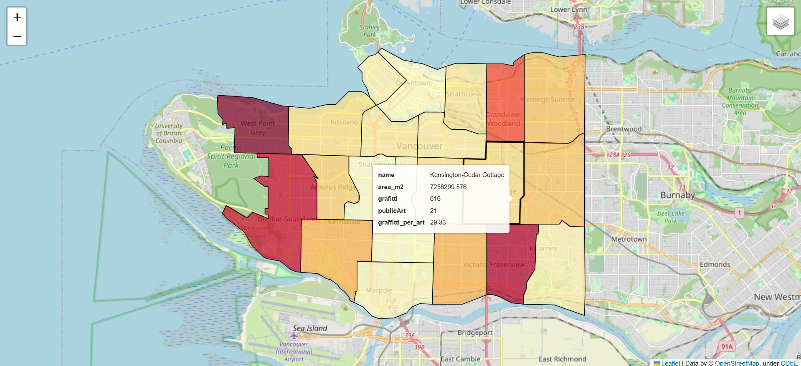

# GeoPandas Study

Practiced using GeoPandas in Python for spatial data operations by replicating the PostGIS project that calculates the ratio between graffiti and art pieces in vancouver

## What I Did
- Downloaded graffiti and public art datasets from (https://opendata.vancouver.ca/)
- Loaded data into GeoDataFrames using GeoPandas
- Used sjoin and merge to calculate graffiti art pieces relative to public art pieces by area
- Displayed on an interactive map using Folium
	

## Map Preview

## Skills Practiced
- Pandas and GeoPandas
- Python data manipulation
- Visualizing Geospatial data with Folium
- Spatial Joins

## Tools
- Python
- Pandas
- GeoPandas
- Folium
- Branca colormap
